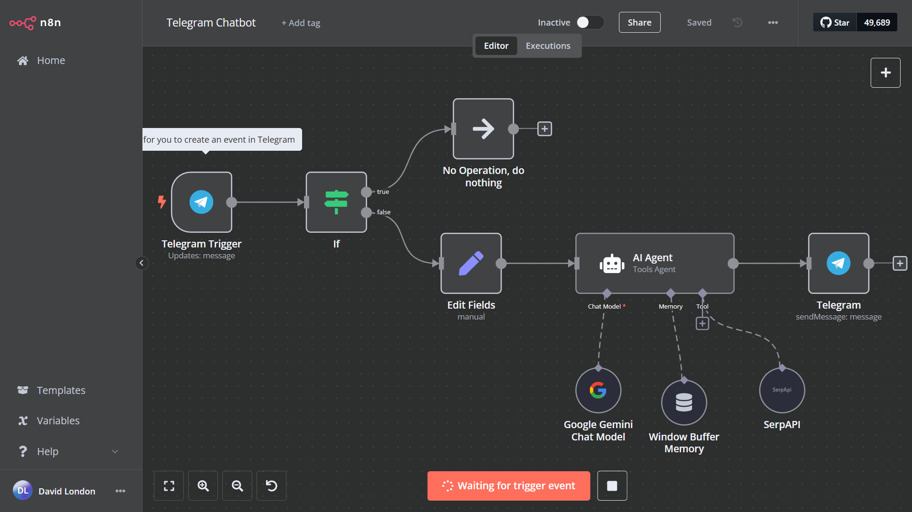

# Chatbot de Telegram con Docker y N8N

Este proyecto implementa un chatbot para Telegram utilizando una imagen personalizada de Docker para el backend y nodos configurados en [N8N](https://n8n.io/) para el flujo de trabajo. 

## Características

- Integración con la API de Telegram.
- Configuración de flujos mediante N8N para lógica del chatbot.
- Implementación en un entorno Dockerizado para facilitar la portabilidad.

---

## Requisitos

- **Docker y Docker Compose** instalados.
- Cuenta en Telegram para crear un bot (obtener el token desde [@BotFather](https://core.telegram.org/bots#botfather)).
- N8N configurado y en ejecución.

- Encontrarás al bot en t.me/UtepitoBot o @UtepitoBot en Telegram

---

## Configuración del Proyecto

### 1. Crear la imagen Docker

1. **Construir la imagen Docker**
  docker build -t tg-chatbot

2. **Crear el flujo de trabajo en n8n**
  docker run -d --name n8n -p 5678:5678 n8nio/n8n

3. **Configurar las variables de entorno**
  docker run -d -e TELEGRAM_TOKEN=<TU_TOKEN> tg-chatbot

### 2. Ejecutar el flujo en N8N

- Accede a la intefaz de N8N en http://localhost:5678.
- Activa el flujo

